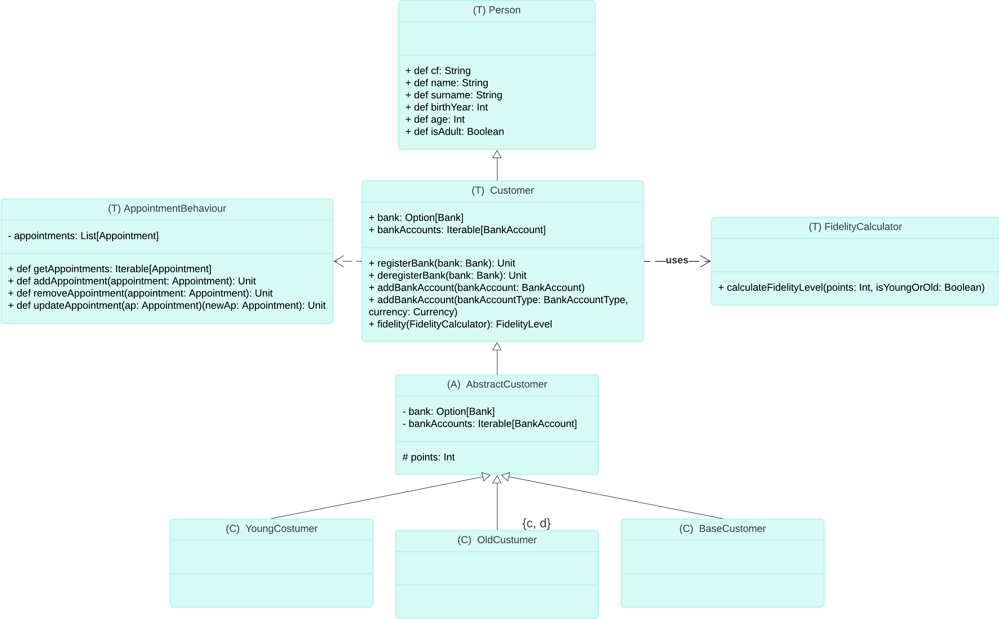
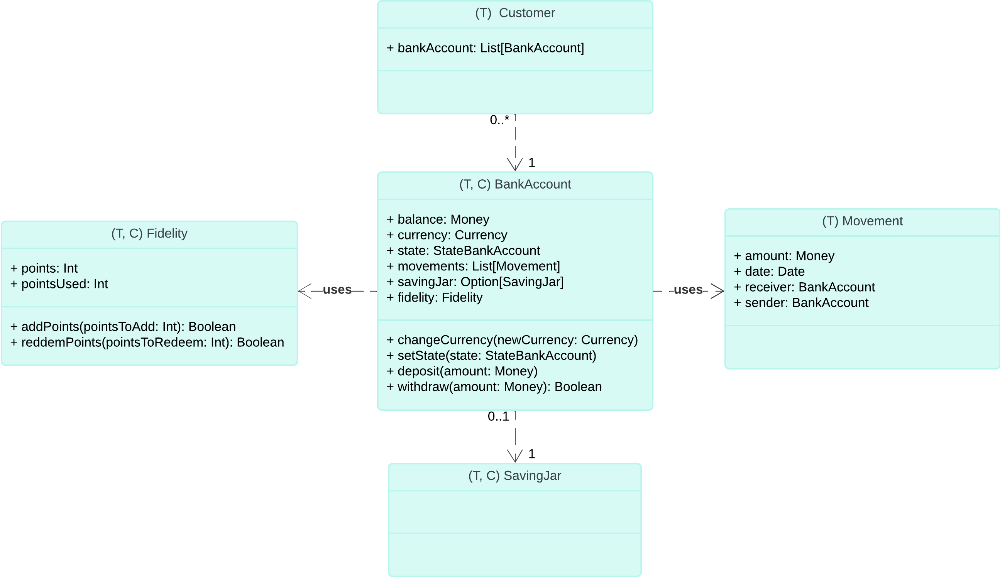

# Documentazione Implementativa

Durante lo sviluppo dell'applicazione, mi sono occupato principalmente delle funzionalità relative ai Clienti, ai Conti Correnti e al Salvadanaio. 

Queste tre macro-aree sono state sviluppate in corrispondenza dei tre sprint. In alcune situazioni, è stata necessaria la collaborazione dei colleghi.

# Parte 1
## Struttura generale

Il seguente diagramma UML mostra che `Customer` estende `Person`, ereditando di questa le proprietà e i comportamenti. `Customer` aggiunge nuove funzionalità per la gestione dei conti bancari, della registrazione a una banca e del calcolo della fedeltà.



Tuttavia, queste funzionalità comuni non sono implementate direttamente nelle classi concrete del cliente, ma in una classe astratta chiamata `AbstractCustomer`. Questo approccio rispetta il principio DRY, centralizzando l'implementazione comune e riducendo la duplicazione del codice.

Nello schema UML, la notazione (T) rappresenta un trait o un'interfaccia, (C) indica una classe concreta che implementa quel trait, mentre (A) indica una Classe astratta.

La notazione {c,d} nella generalizzazione di `AbstractCustomer`, rappresenta una gerarchia completa e disgiunta.


## Descrizione delle classi:

### Person

In collaborazione con Bedei, è stata sviluppata l'interfaccia e la classe implementativa di `Person`([vedi paragrafo Bedei](../andrea/andrea.md)).

### Customer

Il `Customer` rappresenta il cliente di una banca. In questo trait sono definiti gli attributi e i comportamenti che un cliente dovrebbe avere.

Il `Customer` è una specializzazione di `Person` e utilizza il trait `AppointmentBehaviour`. Quest'ultimo è combinato con `Customer` tramite with, permettendo d'integrare i comportamenti di `AppointmentBehaviour` all'interno di `Customer`.

```scala 3
trait Customer extends Person with AppointmentBehaviour:
```

La motivazione di aggiungere `AppointmentBehaviour` a `Customer` è che i metodi definiti in `AppointmentBehaviour` sono utilizzati sia da `Customer` che da `StaffMember`, i quali necessitano entrambi di funzionalità comuni per la gestione degli appuntamenti. Questo approccio permette di evitare duplicazioni di codice.

### AbstractCustomer

La classe astratta `AbstractCustomer` si mette in mezzo tra interfaccia del `Customer` e delle sue implementazioni.

Questo livello intermedio ci permette di poter implementare i metodi di `Customer` che sono comuni nelle classi implementative.

In questo contesto, si potrebbe considerare l'utilizzo di un trait invece di una classe astratta per implementare i metodi comuni. La differenza principale tra i due approcci è che il trait supporta ereditarietà multipla mentre la classe astratta no. Un'altra particolarità delle classi astratte è che possiamo passare parametri e usare campi di classe privati.

### Customer implementazioni

Nel sistema quindi ho la possibilità di utilizzare ben tre classi di `Customer`: una versione per lo Young, una per il Base, e una per l'Old. 

Queste si differenziano solamente per il calcolo della `Fidelity`, ma in un futuro si potrebbe estendere ad altri comportamenti. Si noti che questo metodo non è implementato nella classe astratta.

### FidelityCalculator

Il trait `FidelityCalculator` specifica il comportamento di come è calcolata la `Fidelity` di un `Customer`.

## Meccanismi e pattern utilizzati

- **Pattern Factory** Il Pattern Factory è utilizzato con il metodo `apply` per creare istanze di `Customer`. Rispetto a un'implementazione tradizionale vista a lezione, ho optato per una soluzione con delle differenze: a seconda del valore passato come `birthYear`, viene creata un'istanza di `YoungCustomerImpl`, `BaseCustomerImpl` o `OldCustomerImpl`. Questo approccio nasconde l'implementazione delle classi concrete all'esterno, quindi è restituita un' implementazione del trait `Customer`.
```scala 3
def apply(cf: String, name: String, surname: String, birthYear: Int): Customer = Person(cf, name, surname, birthYear) match
  case person if person.age < 35 =>
    val customer = YoungCustomerImpl(cf, name, surname, birthYear)
    customer
  case person if person.age > 65 =>
    val customer = OldCustomerImpl(cf, name, surname, birthYear)
    customer
  case _ =>
    val customer = BaseCustomerImpl(cf, name, surname, birthYear)
    customer
```
Da notare che viene creata un istanza di `Person`, questa ci è utile per calcolare l'età.

- **Pattern Strategy** Il Pattern Strategy è realizzato utilizzando il meccanismo dei given. Il calcolo della `fidelity` è incapsulato in una implementazioni di `FidelityCalculator`. Questo permette di cambiare facilmente il comportamento del calcolo della `fidelity` semplicemente fornendo una diversa implementazione di `FidelityCalculator`, senza dover modificare le classi `Customer`.
```scala 3
given defaultFidelityCalculator: FidelityCalculator with
  def calculateFidelityLevel(points: Int, isYoungOrOld: Boolean): FidelityLevel = ...
```
Grazie alla given si indica di utilizzare, in questo caso, la `defaultFidelityCalculator`.
```scala 3
override def fidelity(using calc: FidelityCalculator): FidelityLevel = calc.calculateFidelityLevel(points, false)
```
In questo modo utilizzo l'algoritmo passato nella given.


- **Mixin** Combinazione del trait di `AppointmentBehavior` all'interno di `Customer`, in questo medo utilizzo i metodi di `AppointmentBehavior` all'interno del `Customer`.


- **Export** Utilizzo la delegazione su un oggetto `Person`.


- **Enumerazioni** Utilizzo degli enum per restituire un `FidelityLevel`.


- **Dependency Injection** Utilizzo nel `logger`.

# Parte 2
## Struttura generale 

Per la specifica del conto corrente sono stati sviluppati un trait, che ne definisce i comportamenti e gli attributi, e una sua classe implementativa.



La notazione (T,C) indica un trait e la sua classe implementativa corrispondente, sviluppata proprio con il pattern factory e il metodo apply del companion object.

Come si può notare dal'UML il `Customer` ha una lista di `BankAccount`, e solo attraverso l'istanza di `Customer` è possibile creare un conto corrente.

Logicamente il conto corrente è associato a una banca, quindi alla creazione del conto corrente l'utente deve essere registrato a una banca. 

Una specifica, che ci siamo dati noi, è la possibilità di avere diverse tipologie di conto corrente, inseribili dagli utenti. Ciascuna banca avrà una lista di tipologie conti correnti. Queste si differenziano per fee nei movimenti e interessi nel salvadanaio.

Nella creazione di un conto corrente, quindi, il cliente, dovrà scegliere una tipologia di conto corrente, che la banca a cui è registrato mette a disposizione.

```scala 3
def addBankAccount(bankAccountType: BankAccountType, currency: Currency): Unit
```

Questo metodo aggiunge un conto corrente alla lista dei conti correnti di un cliente.

## Descrizione delle classi

### BankAccount

Il trait e la classe implementativa di `BankAccount`, rappresentano il concetto di conto corrente.

I principali attributi, sono `balance` di tipo `Money`, `currency` di tipo `Currency`(le classi `Currency` e `Money` implementate da Bedei), descrivono il bilancio e la valuta associato a questo.

Altri attributi sono uno `state`, implementato con una enum, una lista di `Moviments`, e un campo che rappresenta la `Fidelity`.

Tutti i movimenti del conto corrente sono stati sviluppati dal collega Bedei.

### Fidelity

Il concetto di Fedeltà, rappresenta semplicemente, un punteggio di un conto corrente.

Questo punteggio può essere incrementato ogni qualvolta che si eseguono operazioni (nel nostro sistema per ogni deposito).

Nella classe dei `Customer` è presente il metodo `Fidelity` che attraverso una given calcola un `FidelityLevel`(un enum che assume valori: Bronze, Silver, Gold, Platinium).

Il calcolo è eseguito sommando tutti punteggi delle `Fidelity` dei conti correnti presenti.

```scala 3
protected def points: Int = bankAccounts.map(_.fidelity.points).sum
```

## Meccanismi e pattern utilizzati

- **Pattern Factory** Utilizzo nella creazione del `BankAccount` e della `Fidelity`.


- **Enumerazioni** Utilizzo per lo stato di un `BankAccount`.

- **Given** Utilizzo per il cambio di valuta.
```scala 3
override def changeCurrency(newCurrency: Currency, conversionFee: BigDecimal): Unit =
  val converter = CurrencyConverter()
  balance = converter.convertWithFee(balance, currency, newCurrency)(using conversionFee)
  currency = newCurrency
```


- **Dependency Injection** Utilizzo nel `logger`.

# Parte 3
## Struttura generale

In questa ultima parte, ho sviluppato il concetto di salvadanio per un conto corrente.

Il salvadanio permette, ai clienti di poter depositare e ritirare dei soldi su questo. Se la tipologia di conto corrente possiede un interesse maggiore di 0, di avere un incremento del bilancio con cadenza annuale.


Si noti che il conto corrente può avere o no il salvadanio.

## Descrizione delle classi

### SavingJar

Il trait `SavingJar` e la sua corrispondente classe implementativa rappresentano il concetto di salvadanaio.

In questo sono presenti tutti i metodi che possono rappresentare il suo comportamento.

In particolare abbiamo depositi e prelievi, entrambi possono essere negati se il bilancio del conto corrente è minore di quanto si vuole depositare, e se il bilancio del salvadanaio è minore di quanto si vuole prelevare.

Lo scambio di denaro tra salvadanaio e il corrispondente conto corrente avviene poichè nella creazione del salvadanaio gli si passa come riferimento il conto corrente (`bankAccount` nel codice seguente).
```scala 3
override def deposit(amount: Money): Boolean = amount match
    case am if am <= bankAccount.balance =>
        if bankAccount.withdraw(amount, 0.toMoney) then
          _balance = _balance + amount
          true
        else
          throw IllegalArgumentException()
    case _ => throw IllegalArgumentException()
```
In deposit, infatti, si utilizza l'oggetto `bankAccount` per ottenere il bilancio e per eseguire su questo un prelievo.


Nel metodo della proiezione del bilancio del salvadanaio si utilizza il mese attuale per calcolare la proiezione di fine anno. Si sommano al bilancio attuale i depositi mancanti per arrivare alla fine dell'anno solare dopodichè si aggiunge l'interesse calcolato sul bilancio totale.

Se year è maggiore di 1 si entra nel for in cui si sommano i 12 depositi di un anno.
```scala 3
override def annualProjection(year: Int): Money =
    var projectedBalance = _balance
    val monthsLeft = 12 - LocalDate.now().getMonthValue + 1
    
        projectedBalance = projectedBalance + (monthlyDeposit * monthsLeft)
        projectedBalance = projectedBalance * (1 + annualInterest / 100)
    
        for _ <- 2 to year do
          projectedBalance = projectedBalance + (monthlyDeposit * 12)
          projectedBalance = projectedBalance * (1 + annualInterest / 100)
        projectedBalance
```


## Meccanismi e pattern utilizzati

- **Pattern Factory** Utilizzo nella creazione del `BankAccount` e della `Fidelity`.


- **Given** Utilizzo per il cambio di valuta.


